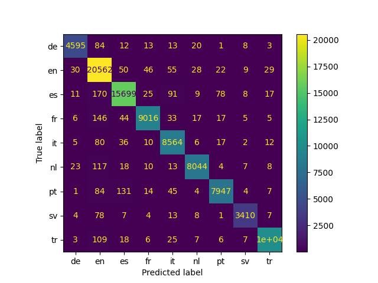

# Language Identification

Language Identification is the task of identifying the language of a given document.

## Model
This repository implements the Bi-LSTM model proposed in the paper ["A reproduction of Apple’s bi-directional LSTM models for language identification in short strings"](https://aclanthology.org/2021.eacl-srw.6/) using Pytorch.

## Dataset
The dataset is a subset of the [OpenSubtitles corpus]((https://aclanthology.org/L16-1147/)) using the following languages: English, Spanish, French, German, Italian, Portuguese, Turkish, Dutch, and Swedish. 

Due to storage and computational constraints, a subset of 450,000 examples is used, keeping the imbalance distribution.  


The number of instances per language after deleting repeated examples and the number of examples in the subset are shown in the table below:

| Language | Total instances | Subset instances | Percentage |
| :--- | :---: | :---: | :---: |
| English (en) | 85,595,047 | 104,153 | 23.15 % | 
| Spanish (es) | 66,188,331 | 80,540 | 17.90 % | 
| French (fr) | 38,168,787 | 46,445 | 10.32 % | 
| German (de) | 19,512,305 | 23,743 | 5.28 % | 
| Italian (it) | 35,881,400 | 43,661 | 9.70 % | 
| Portuguese (pt) | 33,847,797 | 41,187 | 9.15 % | 
| Turkish (tr) | 42,230,889 | 51,388 | 11.42 % |  
| Dutch (nl) | 33,875,984 | 41,221 | 9.16 % | 
| Swedish (sv) | 14,514,609 | 17,662 | 3.92 % |
| Total | 369,815,149 | 450,000 | 100 % |

## Methodology
### Text preprocessing
* All texts were converted to lowercase.
* Punctuation symbols and special characters were removed.
* Duplicate examples were removed.

### Subset creation and data splitting

* $N$ random examples were selected based on the percentage of each language in the entire dataset and the desired subset size using the rule of three.

* The subset was divided into training (80%) and testing partitions (20%) preserving the percentage of samples for each class.

* Statified K-folds with $K=5$ were created using the training partition to obtain training and validation splits for cross-validation.

### Experimental details
* AdamW optimizer with learning rate = 0.001
* Epochs = 25
* Patience = 5
* Cross-entropy as the loss function
* Character embedding dimension = 150
* LSTM hidden dimesion = 150

### Ensemble learning
* The Bagging technique is for ensemble learning.
* The final predictions consists of the average of the outputs of each model trained in a different fold $k$. 


## Results
* Macro F1-score is used as the performance metric.
* Performance on the test set is reported for each model trained with a different fold $k$.

| Model $_k$ | Macro F1-score |
| :---: | :---: |
| 1 | 0.9729 |
| 2 | 0.9716 |
| 3 | 0.9727 |
| 4 | 0.9724 |
| 5 | 0.9717 |
| Avg | 0.9723 |

* It is possible to observe that the ensemble outperforms all single models. Detailed classification report for the ensemble is shown in the following table:

| | precision | recall | f1-score | instances |
|:---: | :---: | :---:  | :---:  | :---:  |
| de | 0.9823 | 0.9676 | 0.9749 | 4,749 |
| en | 0.9595 | 0.9871 | 0.9731 | 20,831 |
| es | 0.9803 | 0.9746 | 0.9774 | 16,108 |
| fr | 0.9860 | 0.9706 | 0.9782 | 9,289 |
| it | 0.9675 | 0.9808 | 0.9741 | 8,732 |
| nl | 0.9878 | 0.9757 | 0.9818 | 8,244 |
| pt | 0.9820 | 0.9648 | 0.9733 | 8,237 |
| sv | 0.9855 | 0.9655 | 0.9754 | 3,532 |
| tr | 0.9914 | 0.9824 | 0.9869 | 10,278 |
| Macro F1 |  |  | 0.9772 | 90,000 |


* The confusion matrix of the ensemble is shown as a heatmap in the following image:



## Usage

### Dependencies
* Python 3.12.3
* Pandas 2.2.2
* Torch 2.2.1
* Numpy 1.26.4
* Sklearn 1.4.1

### Data preprocessing
* Download the dataset
```
sh download_openSubtitles.sh
```

* Creating the subset
```
python preprocessing.py
```

* Creating the folds for cross-validation
```
python data_splitting.py
```

### Model training and evaluation
```
python main.py --fold <int> --embedding_dim <int> --hidden_dim <int> --batch_size <int> --epochs <int> --learning_rate <float> --patience <int>
``` 

